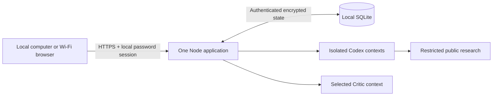

# Local application architecture

22 September 2026. Target architecture for the explicitly authorized existing-application refactor. These decisions define implementation and verification work; they do not claim that an operating system, browser, provider or recovery check has passed.

## Current drivers and source references

Consumes the current [PRD](prd.md), [context](project-context.md), [terms](canonical-terms.md), [guardrails](guardrails.md), [journey](user-journey.md), [screen map](screen-map.md), [wireframes](wireframes.md), [design brief](design-brief.md) and [model settings](model-settings.md). Preserve `nanoduck-electric-a-v8-20260914`, its exact frozen target/tree and the documented local-access behavior correction. The owner requires macOS, Linux and Windows execution plus browser access from the running computer and the same Wi-Fi/local network.

## One application with durable work

One Node application serves the browser UI and HTTPS API, owns one local SQLite data store and coordinates isolated provider subprocesses. Supported Node ranges are `^22.13.0 || ^24.0.0`; the lockfile pins application dependencies and provider packages. No compilation of the browser UI is required. Browser clients use current Safari, Chrome, Edge or Firefox; no extension is needed.

The simplest boundary is one process and one authoritative data file. A second small SQLite file holds only an exclusive process lock; it contains no application record. This prevents a second process from accepting work against the same data directory. OS-held locks release after a crash. There is no separate queue, network database or background service installation.

## Minimum persistence contract

Serialize every accepted mutation and durably commit it before returning success. A client request ID prevents duplicate acceptance; a draft is not accepted work. Persist complete state—including sessions, consent, preferences, instruction versions, conversations, runs, request IDs, pending attachments, sources and recovery/deletion records—inside authenticated encryption before SQLite receives its payload. Use the existing authenticated-encryption primitive with a fresh nonce for each encrypted snapshot and a separate randomly generated local key. SQLite stores no plaintext prompt, conversation, attachment, session or run snapshot. Reject tampered state without falling back to an empty store.

The initial single-owner implementation stores an encrypted complete-state payload with a 128 MiB serialized-state limit. Reject an over-limit mutation before replacing durable state and report the storage condition truthfully. This deliberate small-system limit avoids an unbounded memory snapshot; a future larger-store design requires architecture review. Transactions and serialization prevent lost updates. Keep schema/version metadata sufficient to refuse an incompatible state without deleting it.

Accept a message and advance its run atomically. Commit each completed work-item result and checkpoint atomically into the ordered event stream; U-09 replaces ordinal step recovery for new runs. The browser polls committed events after its cursor; this avoids depending on a long-lived browser connection. Stop advances the run generation. A provider response commits only while its generation still matches and this process retains exclusive store ownership. Restart recovers unfinished work from durable checkpoints without repeating confirmed results. A provider call may repeat if the process stopped before committing it; promise one confirmed visible result per step, not exactly-once provider execution.

Recovery serializes under the same owner/run lock, rejects a second active run and retains the accepted settings/instruction snapshot. System notices remain display/export events but cannot count as specialist or Critic contributions. Retry targets failed or missing work items and assessments, retaining successful siblings. A stale worker, late result or duplicate request cannot overwrite confirmed work.

## Browser control and incoming sound

The browser derives active work from the server run state. It hides the composer while an active run is confirmed and exposes the separated Stop control required by FR-03.4. Keep any unsent draft in page memory; never persist it to browser storage or silently enqueue it. Preserve authenticated, CSRF-protected Stop and generation fencing. A pending or rejected Stop is not completion: retain truthful active state until the server confirms a terminal state. After Stop, completion or failure, the restored composer may explicitly submit a new independent request into the same record; Continue reuses accepted context and snapshots.

Load the saved message-sound setting on authenticated entry independently of the Settings form, before replaying live event notifications. Use one persistent HTMLAudioElement per session in every supported browser, with the saved exact WAV staged for playback. Prime it directly during a trusted user gesture by playing a finite 50 ms all-zero local WAV through its natural ended event, then stage the saved source on that same element. Incoming alerts rewind and replay the staged source. An explicit Preview temporarily selects its requested source on the same element, then restores the saved source without changing the preference. Keep the accepted Knock asset bytes and versioned URL and the generated Chime/Ripple WAV patterns unchanged. This media path replaces Web Audio output and does not set an AudioSession override. Complete playback only at natural ended, with an eight-second timeout and explicit blocked/unavailable recovery; internal completion is not proof the owner heard it. Cancel old playback with pause/load and a generation guard so late events cannot change current readiness. Off releases the source and local Blob URLs; a deliberate Preview while Off releases them after completion. Dispose on logout and retain visual feedback independently. Preview of an unsaved choice must not overwrite the saved alert preference. Alert only for newly committed agent-message IDs in polling, never for initial history, owner/System events or repeated IDs. Coalesce one polling batch into one alert; a replay after reconnect cannot duplicate it. Playback rejection updates a visible blocked/unavailable state and explicit Enable sound action; visual and semantic announcements remain independent of audio. Device mute, background suspension and physical audibility require actual device evidence; a resolved play promise alone is not an audible-delivery claim.

## Agent and research contract

Head, consultants and Critic remain separate model invocations. The new assignment-based contract below supersedes the sequential fixed-roster/mandatory-pair/closing-speech coordinator for newly accepted runs. Head produces a coordinated plan with individually addressed exact tasks, dynamic role guidance and dependencies; the application schedules and stores work without semantic task substitution. The complete current accepted owner message appears once in each private participant input; selected discussion/evidence follows explicit references. Image metadata retains the current text-only capability disclosure. Critic jointly assesses current results for user-selected depth and owns fulfillment judgments. Existing deployed code remains sequential until U-09 is separately implemented and verified.

The runtime prompt-contract module validates headings/placeholders and renders only the encrypted document snapshot accepted with the run. First-run setup can initialize an empty store from reusable public instructions; private edits and version history remain local. Subsequent startup never replaces edited instructions with defaults. Settings saves/restores create new revisions using optimistic concurrency; active runs keep exact Markdown/revision/hash. Preserve the four existing consulting guidance editors: AGENTS.md, CONSILIUM.md, CONSULTING_PLAYBOOK.md and WORKING_CONTEXT.md. Only these fixed names are accepted; each document is nonempty Markdown of at most 64 KiB. Keep encrypted append-only saved versions, stale-revision protection, review and explicit restore into a new revision. Accepted runs snapshot all four documents and their revisions; edits affect future runs only. Guidance cannot grant tools, change permissions or weaken code-enforced rules. Security, language, role-routing and resource limits are code-enforced and cannot be weakened by that document.

Preserve current subscription adapters, catalog validation, provider/model/effort choices and bounded provider execution. Codex uses `turn-deadline.mjs`: 540,000 ms without matching-thread/turn work expires as `provider_idle_timeout`; an independent 1,800,000 ms ceiling expires as `provider_timeout`. Only nonempty assistant/reasoning deltas or identified item start/completion events renew inactivity. Wrong-turn events and generic notifications cannot extend it. Progress is activity evidence, never a confirmed answer. Cancellation, connection closure and terminal failure still end the call promptly; dispose both timers on every exit. Log only elapsed/idle milliseconds and progress counts, never reasoning, queries or raw provider payloads. Each timeout receives a distinct saved System explanation and the existing Retry action; no automatic resubmission or model/effort substitution. Claude has a 1,800,000 ms absolute inference deadline; the separate sign-in inspection deadline remains 20,000 ms. Processes share a private temporary directory only within their accepted request scope and receive the smallest required configuration; cancellation terminates it and removes temporary credentials. A successful terminal event matching the active thread/turn permits message commit; partial deltas, unrelated events, closed connections and failed completion cannot become confirmed messages. One bounded same-role replacement may recover a policy-invalid draft; neither rejected draft nor tool transcript is persisted. Saved System events and hidden reasoning never enter role context as business contributions.

Transport Claude’s complete UTF-8 context without private text in command-line arguments. Scoped calls place trusted policy plus explicitly untrusted JSON-quoted owner context in a private mode-0600 system-prompt file, giving the CLI a stable cache boundary; changing evidence, assignment and discussion go through stdin. Unscoped calls retain the complete stdin prompt. Remove each temporary context file on exit and release the request-isolated workspace when the run ends. File tools and session history remain disabled. Remove the former 32,000-character owner-message, 80,000-character discussion and role-output truncation rules. A 16 MiB HTTP request ceiling, 128 MiB encrypted-state ceiling and 8 MiB Claude prompt/output transport ceilings protect local resources without silently editing accepted content; the actual provider may have a smaller context capacity. A local overflow fails before inference as a request-size condition with the saved record and recovery action; it must not claim the selected model or effort is unavailable. Close stdin after the complete write. A failed/partial pipe write cannot produce accepted output; cancellation and the existing deadline terminate the process and clean temporary data.

Codex may use its restricted public research capability when evidence can change the decision. Commit Head's recipient-bound assignments before starting potentially slow public research so the owner sees Head's work while search runs. Head then generates a minimal query in a non-web invocation using the private context. Validate the actual query for contact data, secrets and unsafe URLs, treating the digits in a safe public article URL as part of that URL. Run the web-enabled Codex invocation with only the validated public query, no private discussion and the packaged public instruction contract, rather than putting the whole private consultation in a web-enabled prompt. A private contact elsewhere never disables a safe public search. Save the query, answer and all valid source records in the encrypted run snapshot; attach sources to the first specialist position and include the source ledger in later role context. If the query cannot be made safe or the research provider fails or times out, preserve the confirmed work, record the specific evidence limitation and continue without claiming a fresh check. Cancellation still stops the run. Arbitrary filesystem, shell, computer-control and unrelated tools remain unavailable. Claude Critic is text-only, with command-level tool denial and output filtering, using already committed team evidence. No provider/model/effort substitution, API-key billing fallback, automatic credits or Claude Fast Mode is allowed. Claude Code 2.1.280 exposes both exact IDs `claude-opus-5` and `claude-opus-5-5`; never convert a stored ID to the mutable `opus` alias. Require a successful JSON result to contain exactly the requested model in `modelUsage`; missing or mixed identity fails as incompatible. Preserve existing Opus 5 / High and saved Codex preferences. Sources retain direct URL, title, supported claim and retrieval/publication information without an arbitrary eight-source cap. Content-free completed web-search counts distinguish an observed research action from mere capability or a model claim. Retrieved pages are evidence rather than instructions. English/Ukrainian output and source validation retain the PRD’s prohibited-language/domain boundary without rejecting valid shared Ukrainian words.

Validate generated prose separately from source metadata. English descriptors such as “Russian” and “Belarusian” are English words, not evidence that a response switched languages. Remove a sentence containing a distinctive prohibited-language signal from generated prose, display an omission marker and commit the remaining useful response without stopping the run; no prohibited text reaches the record. A fully unusable answer still receives one same-role correction before it can fail. Drop unapproved or non-public URLs from source metadata. In otherwise usable generated prose, replace each unapproved URL with an explicit non-link omission marker and retain the rest of the response. Do not present the omitted address as a verified citation. Log only the output kind, policy reason and omission count, never rejected text or URLs. An empty answer is a provider failure rather than a misleading language-policy claim. Critic checks each consultant reply against the complete owner request, the exact Head assignment and available evidence; it names any unsupported claim, missing deliverable, contradiction, circular reply or false certainty with a specific required correction, without inventing flaws. Its closing assessment checks all requested outputs before consensus. A stopped run can Continue at the first missing contribution without replaying the confirmed prefix.

## Identity, grants and preferences

`npm run setup` runs a portable Node CLI on the computer holding the data. It reads a password twice without echo, requires at least 12 characters and supports long passphrases, and stores a salted scrypt verifier rather than the password. It generates distinct random session, data and recovery keys plus a private local certificate authority and leaf certificate. Setup never writes credential values into the repository. Its password-reset action rotates the session signing key, invalidating existing sessions; it does not delete conversations. Certificate renewal updates local address coverage without resetting the password or data keys.

Local Login verifies the password, bounds failed attempts and issues a fresh server-verified 24-hour session. Sessions have no shorter inactivity timeout; Logoff, reset, revocation and security invalidation end access sooner. Processing consent stays separate and is required once per new authenticated session; refresh, inactivity and reopening reuse it within that session. Browser cookies are host-only, Secure, HttpOnly and SameSite=Strict. Multiple authorized local browsers may hold sessions, while the store still permits only one active consultation. Logoff ends the current session; operator password reset invalidates all sessions. There is no browser session list or selective remote-session revocation interface. A local operator reset is the recovery path for a forgotten password; no online account or external identity assertion is involved.

Before routing, validate Host against certificate-covered allowed local authorities. Reject malformed, public or unrelated authorities. For every browser mutation require the exact `https://Host` Origin for that request, not a single fixed address; require CSRF on session-authorized mutations. Thus localhost and permitted LAN addresses work independently without accepting an arbitrary origin. Forwarded headers never establish identity. Password attempts are bounded; the exact values and reset behavior must be verified against the implementation before claiming security readiness.

Expose the exact `gpt-6-sol` catalog entry alongside the preserved Astra choice in both Codex model selectors; specialists inherit the accepted Head/shared-specialist tuple. Codex `0.155.1` provides the observed six efforts, including `ultra`; retain model-specific catalog validation before saving or running. An absent exact model remains visible as unavailable, with no fabricated effort list, alias substitution or automatic preference change. Snapshot the chosen exact model/effort at acceptance so later Settings edits affect only future work.

Provider authentication remains separate. Discover the local Codex authentication path from an explicitly configured `CODEX_HOME` or the current user’s home directory; never hardcode a person’s path. Give isolated child processes only the required protected material and remove temporary copies. Optional Claude authorization has two explicit boundaries: reuse the current OS user’s native subscription sign-in with the matching configured/default Claude config directory, or use an explicit subscription token with an isolated temporary home/config directory. Never replace the native home/config identity when looking up an ordinary sign-in; leave an unset `CLAUDE_CONFIG_DIR` unset so the CLI retains its default credential identity. An explicit subscription token takes precedence over native sign-in. Set `CLAUDE_CODE_PROVIDER_MANAGED_BY_HOST` only in explicit-token mode; omit it from native invocations so ordinary subscription credential discovery remains available. Native mode retains restricted/safe startup and explicit first-party subscription checks; that flag cannot stand in for those checks. The official portable `npm run claude:login` command signs into Claude on the server computer; NanoDuck never receives login codes or browser credentials. Check first-party subscription status before catalog readiness and each inference. Fail closed for logged-out, expired, API-key, Console-billed, third-party or incompatible provider status reported by the CLI; CLI auth status is only configured-authentication evidence; explicit-token status does not validate server-side token validity, entitlement or a model response. Run role calls from a private temporary working directory with restricted/safe startup, no user/project settings or customizations, no built-in or MCP tools, no session persistence and bounded sanitized output. Administrator policy remains in force as part of the operator’s trusted host, as in the existing token route. Restricted/safe flags suppress user/project customizations without providing administrator-policy isolation. Validate reported auth/provider status, CLI completion and exact model identity, failing closed on incompatible or failed outcomes; this repair adds no proactive operating-system or remote-policy inspection subsystem. Preserve the native credential store on cleanup; delete only temporary invocation data. A Check connection action refreshes sanitized capability state without changing saved or unsaved preferences. The browser and runtime-instructions editor never accept or reveal provider tokens. Catalog checks contain no private consultation content. Quota, selected-provider reauthorization and transient failure retain different recovery states.

## Module and boundary map

| Boundary | Product obligations and local consequence |
|---|---|
| Setup/configuration | UC-001; FR-01.1, NFR-10.1, NFR-13.1–13.2. Portable setup, local password verifier, keys, certificates and safe directory permissions. |
| HTTPS/session router | UC-001/UC-003/UC-005; FR-01.1–01.2, FR-08.1. Local Login/Logoff, consent, bounded attempts, Host/Origin/CSRF and private-route checks. |
| Browser shell/composer | UC-001–UC-006; FR-02.1–02.2, FR-03.1–03.6, FR-07.1–07.5, FR-08.1–08.3, NFR-02.1–02.3. Approved responsive composition, semantic controls, safe DOM Markdown, same-tab recovery and optional speech. |
| Coordinator/provider adapters | UC-002/UC-003; FR-02.3–02.8, NFR-01.1–01.4. Separate role contexts, exact immutable snapshots, cancellation, generation fencing and terminal-event confirmation. |
| Research boundary | UC-007; FR-04.1–04.3. Restricted Codex research, source validation, minimized queries and truthful unavailable evidence. |
| Settings/prompt contracts | UC-005; FR-05.1–05.6. Supported provider/model/effort catalog, count/depth/sound preferences, encrypted versioned instructions, stale-save protection and future-run-only updates. |
| Local record store | UC-003/UC-004; FR-06.1–06.3, NFR-01.1–01.2. Durable encrypted full state, single-process ownership and serialized atomic mutations. |
| Export/recovery | UC-004; FR-06.2–06.3, NFR-14.3. RTF transcript-only export, explicit scoped deletion and isolated encrypted backup/restore. |

## Data and product boundaries

Private application data lives outside the repository in a per-user platform directory, with a portable `NANODUCK_DATA_DIR` override. On POSIX systems use owner-only directory/file modes; on Windows apply a current-user access-control list using the platform helper. Fail closed if private permissions cannot be established. The setup/configuration file contains the scrypt verifier and distinct keys; the SQLite data file contains ciphertext. Backups exclude setup keys unless the owner deliberately secures them separately. A copied database alone is insufficient to decrypt records; an attacker controlling the current OS account remains inside the documented local trust boundary.

Image intake accepts only the authenticated owner’s JPEG, PNG or WebP up to 8 MiB and at most four attachments per submitted message. Enforce the byte cap before storage, identify the format from bytes rather than MIME, and perform bounded structural validation. PNG checks chunk boundaries and CRC, a valid IHDR with nonzero format-valid dimensions and legal depth/colour type, required IDAT and terminal IEND, and PLTE for indexed colour. JPEG checks marker/segment lengths, nonzero SOF dimensions and valid frame component count, SOS, nonempty entropy payload and terminal EOI; progressive multiple scans are supported, while deferred-height DNL images are unsupported. WebP checks RIFF/chunk boundaries and image-header dimensions for static VP8/VP8L and VP8X animation with bounded nested frame chunks. These checks inspect the container and compressed-stream headers without decompressing pixels or interpreting metadata. They do not prove that a complete pixel decoder will accept the image, identify malware or establish provenance. Store the original bytes as opaque encrypted data under an internal name; never execute, transform, thumbnail or render them server-side. Protected retrieval uses the identified type, attachment disposition and nosniff. Unsupported formats/variants, mismatched signatures, invalid dimensions, structural truncation and size violations fail before acceptance.

NanoDuck receives no microphone audio. A supported browser’s `SpeechRecognition` or `webkitSpeechRecognition` runs only after explicit Start and permission; disclose that its recognition service may process speech. Use `uk-UA` for Ukrainian. Stop yields editable text; Cancel, close, failure and background transition abort recognition. Unsupported capabilities or insecure/untrusted browser contexts leave typing fully usable. Browser drafts/transcripts stay in page memory; short-lived tab state contains only surface, tab, record ID and scroll offset, never draft or record content, and clears at Logoff.

Exports include only complete confirmed transcript content, times, roles, sources and image references. The RTF encoder escapes braces, slashes and Unicode; it emits no executable fields, hidden run snapshot, credentials or private instructions. Validate the requested time zone and fall back to explicit UTC when absent. Whole-conversation deletion affects only its owned records and attachments.

## Configuration and binding contract

| Setting or command | Contract |
|---|---|
| `npm run setup` | Create protected per-user configuration, password verifier, distinct random keys and local certificates; require confirmation before replacing established credentials. |
| `npm run setup -- --renew-certificate` | Reissue the leaf certificate for current allowed local addresses; preserve password and data keys. |
| `npm run setup -- --reset-password` | Read a new password locally and rotate session signing material; preserve encrypted records. |
| `npm start` | Require completed setup, acquire process ownership and serve HTTPS; fail closed on invalid configuration, unreadable keys, incompatible data or another running instance. |
| `NANODUCK_DATA_DIR` | Optional per-user data-directory override, resolved portably; no person-specific absolute path in public source. |
| `NANODUCK_HOST` / `PORT` | Default local-network listener `0.0.0.0:3000`; support an explicit loopback or private interface. Restrict allowed request authorities even when the socket accepts all local interfaces. |
| `NANODUCK_ALLOWED_HOSTS` | Explicit validated local DNS/IP list replacing automatic name discovery and included in certificate SANs; no arbitrary public authority or wildcard origin. |
| `CODEX_HOME` | Optional portable local provider-configuration root; otherwise discover from the current user home. |
| `npm run claude:login` | Official local Claude subscription sign-in using the bundled CLI; no Console/API billing selection or NanoDuck browser credential form. |
| `CLAUDE_CONFIG_DIR` | Preserve the native Claude credential/config identity consistently for login and server; derive the default from the current OS user. |
| Optional Claude token/candidates | An explicit subscription token uses an isolated home/config; exact candidates and first-party subscription status must validate without model or paid fallback. |
| Private state files | `config.json`, encrypted application SQLite and lock-only `ownership.sqlite`; TLS private files under `tls/`. |
| Shareable trust material | `trust/nanoduck-local-ca.crt` contains only the local CA certificate. Per-device trust instructions distinguish this public certificate from private keys. |

Setup prints certificate names and fingerprint without secret values; application startup prints usable HTTPS local/LAN addresses. Trust installation is an explicit per-device user operation; the app never silently modifies system trust stores. Address changes may require leaf renewal. The running computer’s firewall must allow the chosen port only on the intended private network. Public router forwarding is outside the product scope. A browser warning is not evidence of established trust, and optional speech availability must be probed after trust is configured.

## Security enforcement map

| PRD obligation | Mechanism and evidence obligation |
|---|---|
| NFR-10.1 | Local setup password, salted scrypt verifier, no default credential, bounded failed attempts and local reset; verify correct and denied entry. |
| NFR-10.2 | Random server-verified sessions, 24-hour deadline, visible Logoff, reset/revocation and no activity extension; verify old-token denial. |
| NFR-10.3 | Shared authorization on every private read/mutation, attachment/export, preference and run command; reject forged IDs and immutable fields. |
| NFR-11.1 | Typed bounded requests, parameterized storage, safe process arguments, constructed-DOM Markdown and inert untrusted HTML/URLs. |
| NFR-11.2 | Serialized durable mutations, request IDs, process ownership, generation fencing, bounded provider work and attachment/state limits. |
| NFR-11.3 | Certificate-covered local Host checks, per-request exact Origin, CSRF, Secure/HttpOnly/Strict cookies, CSP, MIME/nosniff and framing denial. |
| NFR-12.1 | Restrict research destinations/protocols/redirects and private/metadata addresses; page instructions cannot widen tool scope. |
| NFR-12.2 | 8 MiB image/signature and bounded container-structure checks, encrypted opaque storage and protected attachment retrieval; browser speech creates no app audio endpoint. |
| NFR-12.3 | Isolated role prompts/tools, text-only Claude Critic, explicit sensitive-transfer permission and no provider/billing fallback. |
| NFR-13.1 | Authenticated full-state encryption, separate random keys, tamper denial, restrictive files/ACLs and tested separated-key recovery. |
| NFR-13.2 | Local CA/leaf and explicit client trust, HTTPS-only application listener, verified external TLS and least local process privilege. |
| NFR-14.1 | Private local data classification, minimized queries, no trackers/content URLs, no private content in public code or diagnostic logs. |
| NFR-14.2 | No-store private responses, page-memory drafts, private-state clearing at Logoff and explicit browser speech lifecycle. |
| NFR-14.3 | Encrypted indefinite records until explicit deletion; isolated backup/restore and deletion-aware restore handling. |
| NFR-15.1 | Pinned dependency inventory, supported Node ranges, only app assets/API served, compatible local updates and tested rollback. |
| NFR-16.1 | Structured sanitized event metadata, protected local diagnostic copy and operator-defined retention; no prompt/token/raw-provider-error logs. |
| NFR-16.2 | Fail-closed validation/storage/authentication, categorized actionable errors, accepted-work preservation and bounded safe retry. |

## Architecture decisions, operations and risks

One application plus encrypted SQLite replaces the need for separate data services and stays portable across the three required operating systems. Full-state serialization is acceptable for a single owner with an explicit 128 MiB limit; it must not be presented as an unbounded database architecture. Local passwords preserve privacy when the application is reachable through Wi-Fi. A local CA permits encrypted network access without an online identity or public domain, at the cost of per-device trust setup. Native browser speech remains optional because browser/service availability varies.

The product owner is the local operator for setup, keys, trust, backup, updates and incident response. Before updating, stop the application, take an encrypted backup and preserve compatible keys separately. Restore only into an isolated data directory first; verify accepted records and deletion decisions before adopting it. If a backup predates a deletion, do not silently reactivate the deleted record: apply current deletion decisions or require explicit reconciliation. Never claim immediate erasure from existing backups. Resetting a forgotten password must not rotate the data-encryption key.

A release claim requires actual macOS/Linux/Windows startup and permission checks, same-network HTTPS browser checks, separate browser core-flow evidence, encrypted-state/tamper/process-lock/restart/restore tests and exact selected-provider execution. Certificate trust and firewall configuration vary by device and remain explicit setup dependencies. Provider availability cannot be proven by a catalog fixture. Performance uses the PRD’s 5/30/60-second targets and ten-minute continuation boundary; no invented uptime promise is added.

Dependency/incident review belongs to the maintainer: inspect reported security issues before the next local update, prioritize an exploitable private-data or access flaw before continued use, and record a dated remedy or mitigation for other confirmed findings. Unrun representative-owner, assistive-technology, actual-device or provider checks stay named evidence gaps. No code inspection, hash or document check closes them.

## Out of scope and open questions

Public internet access, multiuser accounts, billing, automatic external business actions, private-record import from another installation and unrelated visual changes are outside this refactor. No architecture mechanism requires another material product decision. The exact runtime implementation and actual cross-platform/network/provider results must be checked before their corresponding readiness claims; missing evidence remains a limitation, not an invented pass.

## P5 Stop presentation binding

Share `--consultant-avatar-size` and `--consultant-avatar-radius` between `.avatar` and `.stop-consultation`. The white button face follows the approved P5 dimensions; its transparent pseudo-element extends the hit area to 44px high without changing layout. Existing button identity, disabled state, native keyboard semantics, Stop request and generation fencing remain unchanged.

## Assignment-based parallel execution contract

Initial U-09 implementation observed at 7978da8; the current scoped reliability/usage follow-up is authorized. UC-002/UC-003/UC-005; FR-02.9–FR-02.15, FR-03.5, FR-05.3 and NFR-01.2–01.3 govern this correction. Keep one application process and one active consultation; parallel workers are children within that run, not additional owner runs or a new service.

- **Plan and roles:** `prompt-contracts.mjs` renders a concise planning contract for Head. The response envelope carries internal recipient IDs, role name, private role guidance or library reference, exact task text, requested-deliverable references and dependencies. A shared library index is available to Head; only selected entries are included in detail. Persist the coordinated plan once and expose its individual task messages. Validate identifiers, ownership, dependency acyclicity and transport structure, never profession membership or prose style. If metadata is unusable, preserve task text and request only missing structural repair from Head; no generic fallback or repeated semantic drafting. Separate reusable role guidance from fixed output-section validation, so dynamic roles do not require editing an allowlist. Migrate exact shipped instruction defaults only; preserve owner edits and accepted revisions.
- **Work records:** versioned run contract and immutable accepted settings; assignment ID, recipient ID/name, private role guidance snapshot, exact task, context boundary, dependency IDs, result revision and status (`pending`, `running`, `completed`, `failed`, `cancelled`, `superseded`). Maintain attempt identity and generation. Do not use a role display name or transcript array index as identity. Head-directed reassignment/replacement preserves original tasks and selected team-count semantics rather than silently expanding the team.
- **Context:** a conversation message boundary plus accepted owner-message IDs selects the complete original user text/corrections once. Shared instructions/context precede variable role/task text to avoid avoidable prefix churn, without promising provider cache hits. Consultants receive their own role guidance, assignment and referenced dependencies/evidence. Critic receives every current assignment/result and unresolved finding; Head receives the current reviewed result set, delivery checklist and unresolved findings. Keep source URLs/claims needed to assess the work; do not trim owner text or conceal contradictions. Correction input includes the defective result, exact order and relevant conflicting evidence. A patch-like correction is linked to its previous result and materialized deterministically for later readers, not replaced with an AI summary. Historical chat remains append-only. No file tools or separate request document are introduced.
- **Scheduling and persistence:** start ready independent work concurrently, at most the accepted team count and any evidenced provider concurrency capacity; queue additional eligible work with truthful status. Each asynchronous completion commits under the existing serialized store transaction and unique run/assignment/attempt/generation key. Never mutate a shared captured whole-state snapshot outside the transaction. Persist successful siblings despite another failure, then mark the run recoverable after in-flight work settles or is deliberately cancelled. Resolve dependencies only from committed current results. Stop aborts every worker, advances generation and rejects late commits; continuation retries only missing/failed work. Provider activity deadlines stay per call, with no hidden inference retries. Verify real adapter concurrency before readiness claims.
- **Depth:** snapshot `contractVersion` and depth semantics on acceptance. Fixed 1/3/5 means that many team review rounds, not that many mandatory consultant replies. Auto uses Head closure decisions up to ten. Each round has one combined Critic team assessment and any necessary targeted responses. Batch independent corrections into one Critic resolution assessment when ready; do not create a separate full-context review call per consultant. Assess responses before claiming fulfillment. The final correction check is a focused resolution assessment, not permission to start another round. If it remains unresolved, notify Head and retain the issue in provisional synthesis. Never manufacture defects to occupy a round.

### Critic order lifecycle

Persist directive ID, run/generation/context boundary, round, recipient assignment/result revision, exact Critic defect and requested correction, source references, response IDs, resolution assessment and reason. States: `open` → `response_submitted` → `resolved_corrected` or `resolved_objection_upheld`; Critic can instead return `open` or `blocked_evidence`. Stop/failure pauses execution without changing the finding. A new owner correction can cause Head to supersede a task/order with a recorded reason, but `superseded` is not successful fulfillment. Head may carry a finding unresolved into provisional closure; it cannot set a false Critic resolution.

Only an assessment produced on the Critic route, bound to the current order and reviewed response/result revisions, may resolve it. A consultant self-declaration, new message, stale assessment, wrong recipient or missing evidence cannot. Repeated noncompliance is exposed to Head after the assessment instead of creating an automatic retry loop. Head can issue a specific changed assignment or acknowledge the limitation within the user depth; substance is judged by agents, not a keyword classifier. Final synthesis consumes all unresolved/blocked findings; the final Critic assessment and existing consensus conditions remain required for an unqualified agreement claim.

### Compatibility, privacy and efficiency evidence

NFR-10.3/NFR-11.1–11.2/NFR-12.3: bind IDs to conversation/run, render names as text, validate dependency references and keep dynamic guidance below code-enforced tool/data/provider permissions. NFR-13.1/NFR-14.1–14.3: encrypt new records, exclude private role guidance from business transcript/export, delete with their conversation and preserve deletion-aware recovery. NFR-16.1: report content-free call counts, context bytes and provider-reported token categories; absent metrics remain unavailable. Compare identical synthetic settings/depth/deliverables before/after; provider cache/API prices are not subscription-usage proof.

Read legacy records without rewriting their messages or inventing resolution states. Keep legacy accepted runs on their old contract until terminal, or perform a verified explicit checkpoint migration; no live interruption. New runs use the versioned contract and updated depth copy. Migration and rollback use isolated encrypted fixtures and schema checks; an older runtime must refuse unsupported new state rather than corrupt it. Entry points remain `consultation.mjs`, `prompt-contracts.mjs`, `store.mjs`/`local-store.mjs`/`local-state.mjs`, provider adapters, and the existing browser renderer. Assignment/context/review helpers can be extracted behind these boundaries. No native provider subagent feature is needed.

## Critic reliability and model usage — 2026-09-25

The Critic parser groups valid repeated assignment recipients while preserving numbered issue/correction pairs; the coordinator performs at most one repair of genuinely invalid review structure. Claude uses a finite thirty-minute inference deadline because supported Max reasoning can provide no usable text for over nine minutes; cancellation still terminates the process tree. Provider adapters emit content-free per-attempt lifecycle/usage records; Codex consumes matching-thread/turn cumulative token usage and Claude consumes result modelUsage (uncached input + cache read + cache creation). Store usage with each conversation in the encrypted state, validate it on load/restore, deduplicate by attempt ID, and erase it on conversation deletion. An authenticated GET usage endpoint supplies aggregate summaries to the Usage panel. No provider credentials, prompts, results or reasoning are stored in these records. Nonterminal records after interruption remain explicitly incomplete. Existing schema version accepts absent usage as historic unrecorded data.

## Sticky consultation views — 2026-09-25

Use one CSS sticky wrapper around the existing topic and tab list; remove the nested active-topic sticky positioning so Stop and tabs cannot overlap. Preserve the existing tab handlers, keyboard navigation and private content boundaries. Static assets are read on request; this change requires a browser refresh, not a provider/server restart.

## Review repairs — 2026-09-26

The [authorized review repair](../forge/runs/review-fixes-20260926/scope.json) restores existing UC-002/UC-003/UC-007 contracts without new provider permissions or a baseline change.

- Persist one correction attempt per affected consultant per selected round. A later attempt references all currently unresolved predecessor order IDs and carries their exact directives along with new Critic findings. Old answers and assessments remain immutable. A linked predecessor is historical, not falsely resolved; only the latest active attempt controls unresolved/provisional closure. Validate backward, same-assignment, single-successor links. Continue resumes a missing response or assessment without replaying completed attempts; depth remains the owner's setting.
- Re-evaluate dependency readiness whenever a worker finishes. Launch eligible dependents immediately; retain successful siblings and drain started work on a failure before surfacing it.
- Render saved Specialist Position, Specialist Reply, Universal Response Standard and matching role guidance from the accepted runtime-instruction snapshot. Head's private guidance supplements them. Preserve exact task prose. Role transport names share the 64-character persistence boundary and exclude case-insensitive owner/System/Head Consultant/Critic; repair metadata only. Identify owner input by owner role with no recipient, so old generated role collisions cannot become new owner requests.
- Reject secret-like generated bodies/source metadata before any commit or forwarding (NFR-12.2/NFR-12.3/NFR-14.1). Ordinary phone-number output remains supported. Include source title, URL, claim and dates with dependency results, team reviews and correction exchanges. Head's Auto decision and final synthesis receive actual Critic summaries and active order assessments. Final visible sources merge validated Head, team and research sources by URL plus supported claim, preserving earlier evidence for Sources/history/export.
- Critic may return an optional researchRequest describing an evidence gap. Head forms a minimized public query; the existing isolated Codex research route receives only that query and public instructions. Run at most one follow-up search per selected round, checkpoint its result before rework and include it in correction/assessment/final context. Claude remains tool-free. Unsafe/unavailable research stays an explicit limitation. Old rounds without this optional field remain valid.
- Browser progress uses one pending read and capped exponential reconnect delays (2-second healthy cadence; retry delay capped at 30 seconds), with a 15-second read timeout and accessible connection status. Authentication/permanent errors do not retry indefinitely. Stop/logout/conversation replacement fence pending work. Usage refresh coalesces requests for the same session/conversation/scope, preserving valid slow responses; scope changes invalidate old responses and errors/timeouts allow another refresh.

These are implementation mechanisms under existing functional, data-integrity, privacy and continuity requirements. Synthetic/browser receipts are separate from actual provider, device, representative-user and release evidence.

## Source metadata persistence repair — 2026-09-26

Provider-normalized source titles and supported-claim text use the same 16 MiB per-field ceiling as stored message bodies, with existing whole-state and recovery-envelope ceilings retained. The old 280/1000-character recovery checks contradicted the adapters, which preserve complete text, causing completed answers to roll back. Preserve full metadata, URL/language checks and encryption. Categorize local_state_invalid and local_store_capacity_exceeded explicitly in safe failure diagnostics and user feedback; never log answer content. This repairs existing persistence/continuity requirements without changing provider permissions.

## Таблиці в повідомленнях та RTF — 2026-09-26

У межах UC-004/FR-06.2 текст зберігається як Markdown. Спільний `src/client/markdown.js` розпізнає таблиці з рядком роздільників, вирівнюванням і екранованими вертикальними рисками. Невідповідні за кількістю комірок рядки залишаються звичайним текстом без втрати даних. `src/client/app.js` створює семантичні table/thead/tbody/th/td через DOM, без виконання HTML. Контейнер має клавіатурний фокус і горизонтальне прокручування; текст комірок переноситься. `src/server/conversation-export.mjs` перетворює ту саму структуру на нативні RTF-комірки з межами, повторюваним заголовком, вирівнюванням та екрануванням Unicode/RTF. Ширина таблиці обмежена текстовою областю A4. Приватний стан, провайдери та формат збереження не змінюються.

## Реалізація режиму читання — 2026-09-26

Клієнт відокремлює composerCollapsed від стану виконання. Зміна conversation/run/status задає початкове згортання для complete; повторний render не скасовує ручне розгортання. Чернетка залишається у незміненому textarea; зміна розділу доступна через спільний setTab для вкладок і select. CSS використовує дві колонки від 1100px та мобільний select нижче цього порога. Введення у звичайному потоці не перекриває фінал тексту. Серверні контракти, збереження та безпекові межі не змінюються. Погоджений режим читання замінює попередню вимогу автоматично відновлювати composer після completion.

## Isolated request and cache economy — 2026-09-26

New runs persist immutable snapshot.requestMessageId; context selection and source aggregation start at that owner boundary. Legacy paused parallel ledgers preserve their original accepted IDs. Validate the binding during snapshot/work commits and durable restore. provider-context.mjs orders policy/guidance, request scope and owner text before varying output contract/assignment/discussion, excludes WORKING_CONTEXT.md, and measures UTF-8 bytes. Codex uses an explicit minimal consultation baseInstructions, per-invocation ephemeral sessions/credential homes, and an empty private workspace shared only within the executing request and removed after workers drain. Resume may recreate the workspace but keeps accepted app context. Claude remains tool-free/nonpersistent. Head control/query steps receive summaries and relevant gaps instead of full team answers; Critic/final synthesis retain complete required current results. Research reuses current-request public source metadata and targets unresolved facts; no global answer cache or arbitrary search cap. Usage stores allowlisted stage/byte/search-count metadata, never prompts, and sums per-stage model usage without duplicate totals. Remote cache hits/TTL are not controlled by the application.

## Chat beginning and end controls — 2026-09-26

Client-only chat-start/chat-end listeners select Discussion, then scroll to its first/last message. Start accounts for the sticky header; end aligns the last message with the viewport bottom. Reduced motion uses immediate scrolling. No server mutation or restart is needed.

## Centered chat arrows — 2026-09-26

The explicit user correction replaces grouped navigation placement: the up arrow sits at the horizontal center near the viewport top, below global navigation; the down arrow sits at the horizontal center near the bottom safe area. Both remain fixed while scrolling, 44px transparent outlined circles, with existing accessible labels and reduced-motion behavior. They remain confined to the consultation page. No server/session changes.

## Chat boundary visibility — 2026-09-26

Hide the up arrow when the visible content beginning is reached and hide the down arrow when its end is reached; restore each when scrolling away. Hide both when the content fits. Update on scroll, viewport resize, view changes and incoming content without moving the reading position. Preserve centered 44px transparent controls and reduced motion. Navigation follows the currently selected consultation view rather than switching it. No server/session changes.

## U-12 research and evidence economy — 2026-09-26

U-12 research and evidence economy: preserve every distinct supported claim, full accepted owner input, exact models/effort and user-selected depth. Reuse evidence only inside the accepted request, including Continue/Retry. No cross-Send cache. Measure actual prompt construction and research stages before claiming savings. Add an evidence helper that derives stable references from validated source records and compacts repeated source blocks while retaining all prose, qualifications and dates. Resolve references before storing visible messages; unknown references trigger one bounded repair rather than fabricated links. Keep research records in the encrypted parallel ledger. Save validated query, recipients and reuse/fresh decision before search; preserve across cancellation. New fields remain compatible with legacy ledgers. Head selects recipients and reuse; omitted legacy routing conservatively includes all. Diagnostics record only allowlisted numeric search-action/usage counters, never search text, URLs or private prompts. Raw provider token totals remain authoritative; per-step costs are unavailable unless supplied by provider.

## U-12 Critic cache and usage completeness — 2026-09-26

U-12 follow-up: retain an isolated Claude working context within one accepted request without session history or tools. Verify actual provider cache reuse with public synthetic consecutive calls. Preserve every reported token count including retries and failed calls, label partial/unknown metrics and provider-specific cache semantics, expose per-attempt breakdowns without duplicating totals. Keep full owner input, model/effort, discussion depth and independent-Send isolation. Existing Usage layout and Electric A v8 remain; no prototype reuse. User explicitly authorizes implementation and validation.

## U-12 upstream usage verification — 2026-09-26

U-12 upstream accounting follow-up: opt into the pinned Codex experimental raw completion event, extract only numeric usage from upstream metadata, deduplicate by response within the expected turn and reconcile against cumulative totals. Preserve explicit zero versus missing field; never infer writes from uncached input. Store numeric accounting provenance only, never raw responses, attribution IDs, output or hidden reasoning. Display upstream-verified versus legacy normalized counters in existing Usage. Preserve exact models, private context, authentication and live runs. Experimental telemetry failure must not interrupt consulting. Verify real coordinator Critic cache reuse with synthetic data and document historical limits. User explicitly authorizes this investigation and implementation.

## U-13 actionable usage dashboard — 2026-09-26

U-13 enriches attempts at the consultation boundary with immutable request and participant identity plus purpose. Summary groups use the same attempt records and union repeat-work counts. Native account limits have a separate authenticated endpoint, finite timeout, single-flight and TTL. Legacy records have explicit unknown attribution. Client renders text safely and preserves generation guards.

## U-13 reasoning attribution follow-up — 2026-09-26

U-13 reasoning attribution follow-up: Usage model rows and call timeline show the selected reasoning effort. Aggregate by provider, model and effort so different configurations never collapse together. New adapters record actual requested effort. Older calls may recover the value only from a matching immutable single-request snapshot with a known stage, provider and model; otherwise show unknown. Preserve counters, request isolation and privacy. The user authorizes this change and a read-only comparison of saved high/medium runs, not an unqualified quality claim.

## U-13 activity counts follow-up — 2026-09-26

U-13 activity counts follow-up: show five metrics in Usage: consultant assignments excluding Head/Critic, issued review rounds, issued correction orders, research provider-call attempts including retries, and reported search/open/find web actions. Read team counts from saved parallel ledgers and research counts from usage telemetry. Scope follows the selected conversation/all view. Aggregate known values and mark partial coverage; missing older data is never zero. Preserve privacy and active consultations.

## Clear-glass navigation follow-up — 2026-09-26

User-authorized clear-glass top navigation: replace the opaque bar with low-opacity tint, restrained specular edges and saturation/contrast without blur. Preserve geometry, controls, focus indicators and Electric A v8 foundation. Local button tint and text shadow protect label legibility. Reduced-transparency and forced-color preferences receive opaque readable fallbacks. Verify actual navigation markup at narrow and wide widths in isolated browsers. No live-page reload, server restart, session change or consulting interruption.

## Glass edge refinement — 2026-09-26

User-requested glass edge refinement: retain the clear navbar centre and add a polished outer lip plus a hollow curved inner bevel using masked pseudo-elements. The approximately 7px rim alone receives a slight optical filter; no frosted centre. Preserve geometry and click targets; decorative layers ignore pointer input. Hide both layers for reduced transparency and forced colors. Verify mask rendering, focus and mobile layouts in Chromium, Firefox and WebKit without touching the active browser session or restarting the server.

## Navbar refraction renderer — 2026-09-26

User-authorized liquid-glass renderer replaces the rejected metallic bevel. A local canvas paints only the narrow strip from visible application text, solid surfaces and same-origin images, then displaces pixels along a rounded-rectangle optical edge. The centre remains native and clear; controls remain native and sharp. No external capture service, third-party runtime, stored pixels or transmitted content. Ignore inputs and hidden elements. Clear pixels synchronously on privacy lock/logout and on visibility changes; stop rendering for reduced transparency or forced colors. Update on scroll, resize and observed content changes, not a perpetual loop. CSS gradients and arbitrary embedded media are not part of the sampling contract; the application text/solid surface layout is. Verify actual pixel deformation and privacy clearing in all engines, not merely CSS parsing.
