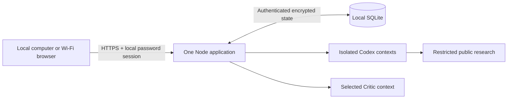

# Local application architecture

22 September 2026. Target architecture for the explicitly authorized existing-application refactor. These decisions define implementation and verification work; they do not claim that an operating system, browser, provider or recovery check has passed.

## Current drivers and source references

Consumes the current [PRD](prd.md), [context](project-context.md), [terms](canonical-terms.md), [guardrails](guardrails.md), [journey](user-journey.md), [screen map](screen-map.md), [wireframes](wireframes.md), [design brief](design-brief.md) and [model settings](model-settings.md). Preserve `nanoduck-electric-a-v8-20260914`, its exact frozen target/tree and the documented local-access behavior correction. The owner requires macOS, Linux and Windows execution plus browser access from the running computer and the same Wi-Fi/local network.

## One application with durable work

One Node application serves the browser UI and HTTPS API, owns one local SQLite data store and coordinates isolated provider subprocesses. Supported Node ranges are `^22.13.0 || ^24.0.0`; the lockfile pins application dependencies and provider packages. No compilation of the browser UI is required. Browser clients use current Safari, Chrome, Edge or Firefox; no extension is needed.

The simplest boundary is one process and one authoritative data file. A second small SQLite file holds only an exclusive process lock; it contains no application record. This prevents a second process from accepting work against the same data directory. OS-held locks release after a crash. There is no separate queue, network database or background service installation.

## Minimum persistence contract

Serialize every accepted mutation and durably commit it before returning success. A client request ID prevents duplicate acceptance; a draft is not accepted work. Persist complete state—including sessions, consent, preferences, instruction versions, conversations, runs, request IDs, pending attachments, sources and recovery/deletion records—inside authenticated encryption before SQLite receives its payload. Use the existing authenticated-encryption primitive with a fresh nonce for each encrypted snapshot and a separate randomly generated local key. SQLite stores no plaintext prompt, conversation, attachment, session or run snapshot. Reject tampered state without falling back to an empty store.

The initial single-owner implementation stores an encrypted complete-state payload with a 128 MiB serialized-state limit. Reject an over-limit mutation before replacing durable state and report the storage condition truthfully. This deliberate small-system limit avoids an unbounded memory snapshot; a future larger-store design requires architecture review. Transactions and serialization prevent lost updates. Keep schema/version metadata sufficient to refuse an incompatible state without deleting it.

Accept a message and advance its run atomically. Commit each completed role message and next step together into an ordered event stream. The browser polls committed events after its cursor; this avoids depending on a long-lived browser connection. Stop advances the run generation. A provider response commits only while its generation still matches and this process retains exclusive store ownership. Restart resumes the last committed step. A provider call may repeat if the process stopped before committing it; promise one confirmed visible result per step, not exactly-once provider execution.

Recovery serializes under the same owner/run lock, rejects a second active run and retains the accepted settings/instruction snapshot. System notices remain display/export events but cannot count as specialist or Critic contributions. Retry targets only the missing role. A stale worker, late result or duplicate request cannot overwrite confirmed work.

## Browser control and incoming sound

The browser derives active work from the server run state. It hides the composer while an active run is confirmed and exposes the separated Stop control required by FR-03.4. Keep any unsent draft in page memory; never persist it to browser storage or silently enqueue it. Preserve authenticated, CSRF-protected Stop and generation fencing. A pending or rejected Stop is not completion: retain truthful active state until the server confirms a terminal state. After Stop, completion or failure, the restored composer may explicitly submit context into the same record; Continue reuses accepted context and snapshots.

Load the saved message-sound setting on authenticated entry independently of the Settings form, before replaying live event notifications. Reuse a browser audio player initialized through a trusted user gesture for Preview and asynchronous incoming playback; keep the accepted Knock asset bytes and versioned URL unchanged. Preview of an unsaved choice must not overwrite the saved alert preference. Alert only for newly committed agent-message IDs in polling, never for initial history, owner/System events or repeated IDs. Coalesce one polling batch into one alert; a replay after reconnect cannot duplicate it. Playback rejection updates a visible blocked/unavailable state and explicit Enable sound action; visual and semantic announcements remain independent of audio. Device mute, background suspension and physical audibility require actual device evidence; a resolved play promise alone is not an audible-delivery claim.

## Agent and research contract

Head, each selected specialist and Critic use separate ephemeral invocations reconstructed from the confirmed record. Preserve the exact topology in FR-02.4 and the whole-team closure required by FR-05.3: Head gives recipient-specific tasks, specialists give independent initial positions, Critic exchanges with every selected specialist, each specialist sends a final position, Critic reviews the final set, and only then Head supplies Consolidated advice. A task must retain the concrete owner-case details and exact recipient. Auto selection remains internal; agreement is never inferred from an incomplete pass. Fixed depth and Auto’s ten-exchange-per-specialist cap stay unchanged.

The runtime prompt-contract module validates headings/placeholders and renders only the encrypted document snapshot accepted with the run. First-run setup can initialize an empty store from reusable public instructions; private edits and version history remain local. Subsequent startup never replaces edited instructions with defaults. Settings saves/restores create new revisions using optimistic concurrency; active runs keep exact Markdown/revision/hash. Preserve the four existing consulting guidance editors: AGENTS.md, CONSILIUM.md, CONSULTING_PLAYBOOK.md and WORKING_CONTEXT.md. Only these fixed names are accepted; each document is nonempty Markdown of at most 64 KiB. Keep encrypted append-only saved versions, stale-revision protection, review and explicit restore into a new revision. Accepted runs snapshot all four documents and their revisions; edits affect future runs only. Guidance cannot grant tools, change permissions or weaken code-enforced rules. Security, language, role-routing and resource limits are code-enforced and cannot be weakened by that document.

Preserve current subscription adapters, catalog validation, provider/model/effort choices and the 540,000 ms provider deadline. Each process receives an isolated temporary working directory and the smallest required configuration; cancellation terminates it and removes temporary credentials. A successful terminal event matching the active thread/turn permits message commit; partial deltas, unrelated events, closed connections and failed completion cannot become confirmed messages. One bounded same-role replacement may recover a policy-invalid draft; neither rejected draft nor tool transcript is persisted. Saved System events and hidden reasoning never enter role context as business contributions.

Codex may use its restricted public research capability when evidence can change the decision. Arbitrary filesystem, shell, computer-control and unrelated tools remain unavailable. Claude Critic is text-only, with command-level tool denial and output filtering, using already committed team evidence. No provider/model/effort substitution, API-key billing fallback, automatic credits or Claude Fast Mode is allowed. Sources retain direct URL, title, supported claim and retrieval/publication information; queries are minimized. Retrieved pages are evidence rather than instructions. English/Ukrainian output and source validation retain the PRD’s prohibited-language/domain boundary without rejecting valid shared Ukrainian words.

## Identity, grants and preferences

`npm run setup` runs a portable Node CLI on the computer holding the data. It reads a password twice without echo, requires at least 12 characters and supports long passphrases, and stores a salted scrypt verifier rather than the password. It generates distinct random session, data and recovery keys plus a private local certificate authority and leaf certificate. Setup never writes credential values into the repository. Its password-reset action rotates the session signing key, invalidating existing sessions; it does not delete conversations. Certificate renewal updates local address coverage without resetting the password or data keys.

Local Login verifies the password, bounds failed attempts and issues a fresh server-verified 24-hour session. Sessions have no shorter inactivity timeout; Logoff, reset, revocation and security invalidation end access sooner. Processing consent stays separate and is required once per new authenticated session; refresh, inactivity and reopening reuse it within that session. Browser cookies are host-only, Secure, HttpOnly and SameSite=Strict. Multiple authorized local browsers may hold sessions, while the store still permits only one active consultation. Logoff ends the current session; operator password reset invalidates all sessions. There is no browser session list or selective remote-session revocation interface. A local operator reset is the recovery path for a forgotten password; no online account or external identity assertion is involved.

Before routing, validate Host against certificate-covered allowed local authorities. Reject malformed, public or unrelated authorities. For every browser mutation require the exact `https://Host` Origin for that request, not a single fixed address; require CSRF on session-authorized mutations. Thus localhost and permitted LAN addresses work independently without accepting an arbitrary origin. Forwarded headers never establish identity. Password attempts are bounded; the exact values and reset behavior must be verified against the implementation before claiming security readiness.

Provider authentication remains separate. Discover the local Codex authentication path from an explicitly configured `CODEX_HOME` or the current user’s home directory; never hardcode a person’s path. Give isolated child processes only the required protected material and remove temporary copies. Optional Claude authorization is explicitly configured locally. The browser and runtime-instructions editor never accept or reveal provider tokens. Catalog checks contain no private consultation content. Quota, selected-provider reauthorization and transient failure retain different recovery states.

## Module and boundary map

| Boundary | Product obligations and local consequence |
|---|---|
| Setup/configuration | UC-001; FR-01.1, NFR-10.1, NFR-13.1–13.2. Portable setup, local password verifier, keys, certificates and safe directory permissions. |
| HTTPS/session router | UC-001/UC-003/UC-005; FR-01.1–01.2, FR-08.1. Local Login/Logoff, consent, bounded attempts, Host/Origin/CSRF and private-route checks. |
| Browser shell/composer | UC-001–UC-006; FR-02.1–02.2, FR-03.1–03.6, FR-07.1–07.5, FR-08.1–08.3, NFR-02.1–02.3. Approved responsive composition, semantic controls, safe DOM Markdown, same-tab recovery and optional speech. |
| Coordinator/provider adapters | UC-002/UC-003; FR-02.3–02.8, NFR-01.1–01.4. Separate role contexts, exact immutable snapshots, cancellation, generation fencing and terminal-event confirmation. |
| Research boundary | UC-007; FR-04.1–04.3. Restricted Codex research, source validation, minimized queries and truthful unavailable evidence. |
| Settings/prompt contracts | UC-005; FR-05.1–05.6. Supported provider/model/effort catalog, count/depth/sound preferences, encrypted versioned instructions, stale-save protection and future-run-only updates. |
| Local record store | UC-003/UC-004; FR-06.1–06.3, NFR-01.1–01.2. Durable encrypted full state, single-process ownership and serialized atomic mutations. |
| Export/recovery | UC-004; FR-06.2–06.3, NFR-14.3. RTF transcript-only export, explicit scoped deletion and isolated encrypted backup/restore. |

## Data and product boundaries

Private application data lives outside the repository in a per-user platform directory, with a portable `NANODUCK_DATA_DIR` override. On POSIX systems use owner-only directory/file modes; on Windows apply a current-user access-control list using the platform helper. Fail closed if private permissions cannot be established. The setup/configuration file contains the scrypt verifier and distinct keys; the SQLite data file contains ciphertext. Backups exclude setup keys unless the owner deliberately secures them separately. A copied database alone is insufficient to decrypt records; an attacker controlling the current OS account remains inside the documented local trust boundary.

Image intake accepts only the authenticated owner’s JPEG, PNG or WebP up to 8 MiB and at most four attachments per submitted message. Enforce the byte cap before storage, identify the format from bytes rather than MIME, and perform bounded structural validation. PNG checks chunk boundaries and CRC, a valid IHDR with nonzero format-valid dimensions and legal depth/colour type, required IDAT and terminal IEND, and PLTE for indexed colour. JPEG checks marker/segment lengths, nonzero SOF dimensions and valid frame component count, SOS, nonempty entropy payload and terminal EOI; progressive multiple scans are supported, while deferred-height DNL images are unsupported. WebP checks RIFF/chunk boundaries and image-header dimensions for static VP8/VP8L and VP8X animation with bounded nested frame chunks. These checks inspect the container and compressed-stream headers without decompressing pixels or interpreting metadata. They do not prove that a complete pixel decoder will accept the image, identify malware or establish provenance. Store the original bytes as opaque encrypted data under an internal name; never execute, transform, thumbnail or render them server-side. Protected retrieval uses the identified type, attachment disposition and nosniff. Unsupported formats/variants, mismatched signatures, invalid dimensions, structural truncation and size violations fail before acceptance.

NanoDuck receives no microphone audio. A supported browser’s `SpeechRecognition` or `webkitSpeechRecognition` runs only after explicit Start and permission; disclose that its recognition service may process speech. Use `uk-UA` for Ukrainian. Stop yields editable text; Cancel, close, failure and background transition abort recognition. Unsupported capabilities or insecure/untrusted browser contexts leave typing fully usable. Browser drafts/transcripts stay in page memory; short-lived tab state contains only surface, tab, record ID and scroll offset, never draft or record content, and clears at Logoff.

Exports include only complete confirmed transcript content, times, roles, sources and image references. The RTF encoder escapes braces, slashes and Unicode; it emits no executable fields, hidden run snapshot, credentials or private instructions. Validate the requested time zone and fall back to explicit UTC when absent. Whole-conversation deletion affects only its owned records and attachments.

## Configuration and binding contract

| Setting or command | Contract |
|---|---|
| `npm run setup` | Create protected per-user configuration, password verifier, distinct random keys and local certificates; require confirmation before replacing established credentials. |
| `npm run setup -- --renew-certificate` | Reissue the leaf certificate for current allowed local addresses; preserve password and data keys. |
| `npm run setup -- --reset-password` | Read a new password locally and rotate session signing material; preserve encrypted records. |
| `npm start` | Require completed setup, acquire process ownership and serve HTTPS; fail closed on invalid configuration, unreadable keys, incompatible data or another running instance. |
| `NANODUCK_DATA_DIR` | Optional per-user data-directory override, resolved portably; no person-specific absolute path in public source. |
| `NANODUCK_HOST` / `PORT` | Default local-network listener `0.0.0.0:3000`; support an explicit loopback or private interface. Restrict allowed request authorities even when the socket accepts all local interfaces. |
| `NANODUCK_ALLOWED_HOSTS` | Explicit validated local DNS/IP list replacing automatic name discovery and included in certificate SANs; no arbitrary public authority or wildcard origin. |
| `CODEX_HOME` | Optional portable local provider-configuration root; otherwise discover from the current user home. |
| Optional Claude token/candidates | Explicit local provider configuration only; no browser credential form, implicit substitute or paid fallback. |
| Private state files | `config.json`, encrypted application SQLite and lock-only `ownership.sqlite`; TLS private files under `tls/`. |
| Shareable trust material | `trust/nanoduck-local-ca.crt` contains only the local CA certificate. Per-device trust instructions distinguish this public certificate from private keys. |

Setup prints certificate names and fingerprint without secret values; application startup prints usable HTTPS local/LAN addresses. Trust installation is an explicit per-device user operation; the app never silently modifies system trust stores. Address changes may require leaf renewal. The running computer’s firewall must allow the chosen port only on the intended private network. Public router forwarding is outside the product scope. A browser warning is not evidence of established trust, and optional speech availability must be probed after trust is configured.

## Security enforcement map

| PRD obligation | Mechanism and evidence obligation |
|---|---|
| NFR-10.1 | Local setup password, salted scrypt verifier, no default credential, bounded failed attempts and local reset; verify correct and denied entry. |
| NFR-10.2 | Random server-verified sessions, 24-hour deadline, visible Logoff, reset/revocation and no activity extension; verify old-token denial. |
| NFR-10.3 | Shared authorization on every private read/mutation, attachment/export, preference and run command; reject forged IDs and immutable fields. |
| NFR-11.1 | Typed bounded requests, parameterized storage, safe process arguments, constructed-DOM Markdown and inert untrusted HTML/URLs. |
| NFR-11.2 | Serialized durable mutations, request IDs, process ownership, generation fencing, bounded provider work and attachment/state limits. |
| NFR-11.3 | Certificate-covered local Host checks, per-request exact Origin, CSRF, Secure/HttpOnly/Strict cookies, CSP, MIME/nosniff and framing denial. |
| NFR-12.1 | Restrict research destinations/protocols/redirects and private/metadata addresses; page instructions cannot widen tool scope. |
| NFR-12.2 | 8 MiB image/signature and bounded container-structure checks, encrypted opaque storage and protected attachment retrieval; browser speech creates no app audio endpoint. |
| NFR-12.3 | Isolated role prompts/tools, text-only Claude Critic, explicit sensitive-transfer permission and no provider/billing fallback. |
| NFR-13.1 | Authenticated full-state encryption, separate random keys, tamper denial, restrictive files/ACLs and tested separated-key recovery. |
| NFR-13.2 | Local CA/leaf and explicit client trust, HTTPS-only application listener, verified external TLS and least local process privilege. |
| NFR-14.1 | Private local data classification, minimized queries, no trackers/content URLs, no private content in public code or diagnostic logs. |
| NFR-14.2 | No-store private responses, page-memory drafts, private-state clearing at Logoff and explicit browser speech lifecycle. |
| NFR-14.3 | Encrypted indefinite records until explicit deletion; isolated backup/restore and deletion-aware restore handling. |
| NFR-15.1 | Pinned dependency inventory, supported Node ranges, only app assets/API served, compatible local updates and tested rollback. |
| NFR-16.1 | Structured sanitized event metadata, protected local diagnostic copy and operator-defined retention; no prompt/token/raw-provider-error logs. |
| NFR-16.2 | Fail-closed validation/storage/authentication, categorized actionable errors, accepted-work preservation and bounded safe retry. |

## Architecture decisions, operations and risks

One application plus encrypted SQLite replaces the need for separate data services and stays portable across the three required operating systems. Full-state serialization is acceptable for a single owner with an explicit 128 MiB limit; it must not be presented as an unbounded database architecture. Local passwords preserve privacy when the application is reachable through Wi-Fi. A local CA permits encrypted network access without an online identity or public domain, at the cost of per-device trust setup. Native browser speech remains optional because browser/service availability varies.

The product owner is the local operator for setup, keys, trust, backup, updates and incident response. Before updating, stop the application, take an encrypted backup and preserve compatible keys separately. Restore only into an isolated data directory first; verify accepted records and deletion decisions before adopting it. If a backup predates a deletion, do not silently reactivate the deleted record: apply current deletion decisions or require explicit reconciliation. Never claim immediate erasure from existing backups. Resetting a forgotten password must not rotate the data-encryption key.

A release claim requires actual macOS/Linux/Windows startup and permission checks, same-network HTTPS browser checks, separate browser core-flow evidence, encrypted-state/tamper/process-lock/restart/restore tests and exact selected-provider execution. Certificate trust and firewall configuration vary by device and remain explicit setup dependencies. Provider availability cannot be proven by a catalog fixture. Performance uses the PRD’s 5/30/60-second targets and ten-minute continuation boundary; no invented uptime promise is added.

Dependency/incident review belongs to the maintainer: inspect reported security issues before the next local update, prioritize an exploitable private-data or access flaw before continued use, and record a dated remedy or mitigation for other confirmed findings. Unrun representative-owner, assistive-technology, actual-device or provider checks stay named evidence gaps. No code inspection, hash or document check closes them.

## Out of scope and open questions

Public internet access, multiuser accounts, billing, automatic external business actions, private-record import from another installation and unrelated visual changes are outside this refactor. No architecture mechanism requires another material product decision. The exact runtime implementation and actual cross-platform/network/provider results must be checked before their corresponding readiness claims; missing evidence remains a limitation, not an invented pass.
